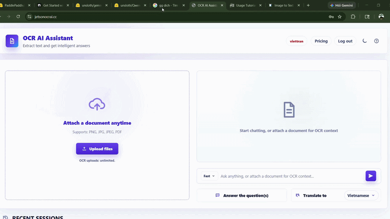
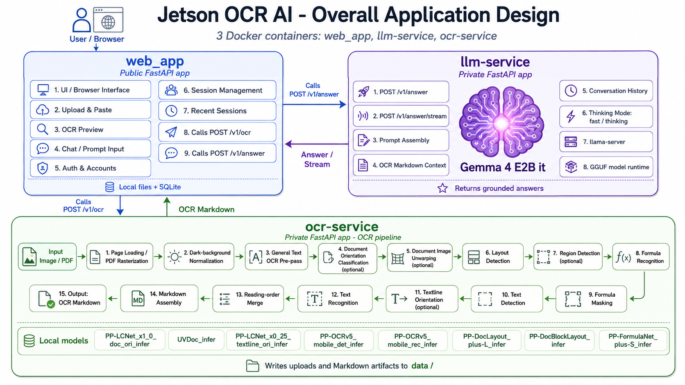

<h1 align="center">OCR AI Assistant</h1>

  <strong>Fast local OCR, web-grounded answers, and multilingual translation on Jetson Orin Nano Super.</strong>

  <a href="https://jetsonocrai.cc"><strong>jetsonocrai.cc</strong></a>

  

## Overview

OCR AI Assistant is a lightweight local OCR + LLM application built for fast document reading tasks. Its full-screen, dark-first browser workspace combines a left session rail, a unified chat transcript, queued multi-file OCR, optional Brave web grounding, and answer or translation actions. It extracts text from images and documents, helps answer questions, and translates OCR results across languages.

## Best For

- Screenshots, notes, exercises, and scanned pages.
- Short OCR tasks that need immediate answers or translation.
- Multiple PNG, JPG, JPEG, or PDF attachments processed sequentially in one session.
- Optional web-grounded answers with source links.

## Limitations

This project is optimized for quick and simple OCR workflows. Very large PDFs, dense academic papers, complex layouts, low-quality scans, or heavily formatted documents may require more processing time and can produce less accurate results. Visual inference is optional: image data is forwarded to the LLM only when the vision gate is enabled and a compatible `LLM_MMPROJ_PATH` is configured. The current host does not have compatible mmproj weights, so actual visual inference requires supplying compatible weights.

## Architecture

  

The application is split into three main services:

- **web_app** — dark-first browser interface, queued upload flow, sessions, optional Brave grounding, and API calls.
- **ocr-service** — OCR pipeline for text, layout, and formula extraction.
- **llm-service** — local LLM service for answers, translation, and prompt handling.

## Documentation

For system design, service details, and workspace layout, see [docs/](./docs/).

## Model Configuration

Runtime model files are stored outside the repo in `/home/viettran_orin/models`.

- `configs/models.host.env` points local host runs to that model root.
- `configs/models.container.env` points Docker services to the same model root mounted at `/models`.
- `BRAVE_SEARCH_API_KEY` is consumed only by the backend for the optional `/v1/llm/context` search integration (with a sibling `F1_fact_checker/.env` fallback); the browser sends a `search_web` flag, never the key.
- `LLM_MMPROJ_PATH` optionally selects a compatible multimodal projector, and `WEB_LLM_VISION_ENABLED` explicitly gates forwarding bounded image data URLs to `llm-service`.
